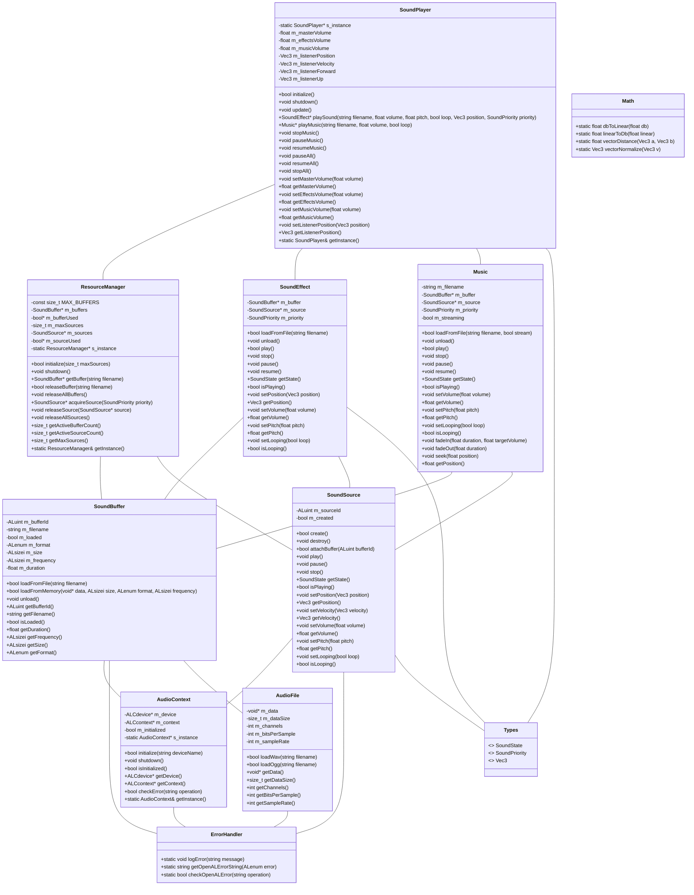

```mermaid
classDiagram
    %% Core Layer
    class AudioContext {
        -ALCdevice* m_device
        -ALCcontext* m_context
        -bool m_initialized
        -static AudioContext* s_instance
        +bool initialize(string deviceName)
        +void shutdown()
        +bool isInitialized()
        +ALCdevice* getDevice()
        +ALCcontext* getContext()
        +bool checkError(string operation)
        +static AudioContext& getInstance()
    }
    
    class ErrorHandler {
        +static void logError(string message)
        +static string getOpenALErrorString(ALenum error)
        +static bool checkOpenALError(string operation)
    }
    
    class Types {
        <<enumeration>> SoundState
        <<enumeration>> SoundPriority
        <<struct>> Vec3
    }
    
    %% Resource Layer
    class SoundBuffer {
        -ALuint m_bufferId
        -string m_filename
        -bool m_loaded
        -ALenum m_format
        -ALsizei m_size
        -ALsizei m_frequency
        -float m_duration
        +bool loadFromFile(string filename)
        +bool loadFromMemory(void* data, ALsizei size, ALenum format, ALsizei frequency)
        +void unload()
        +ALuint getBufferId()
        +string getFilename()
        +bool isLoaded()
        +float getDuration()
        +ALsizei getFrequency()
        +ALsizei getSize()
        +ALenum getFormat()
    }
    
    class SoundSource {
        -ALuint m_sourceId
        -bool m_created
        +bool create()
        +void destroy()
        +bool attachBuffer(ALuint bufferId)
        +void play()
        +void pause()
        +void stop()
        +SoundState getState()
        +bool isPlaying()
        +void setPosition(Vec3 position)
        +Vec3 getPosition()
        +void setVelocity(Vec3 velocity)
        +Vec3 getVelocity()
        +void setVolume(float volume)
        +float getVolume()
        +void setPitch(float pitch)
        +float getPitch()
        +void setLooping(bool loop)
        +bool isLooping()
    }
    
    class ResourceManager {
        -const size_t MAX_BUFFERS
        -SoundBuffer* m_buffers
        -bool* m_bufferUsed
        -size_t m_maxSources
        -SoundSource* m_sources
        -bool* m_sourceUsed
        -static ResourceManager* s_instance
        +bool initialize(size_t maxSources)
        +void shutdown()
        +SoundBuffer* getBuffer(string filename)
        +bool releaseBuffer(string filename)
        +void releaseAllBuffers()
        +SoundSource* acquireSource(SoundPriority priority)
        +void releaseSource(SoundSource* source)
        +void releaseAllSources()
        +size_t getActiveBufferCount()
        +size_t getActiveSourceCount()
        +size_t getMaxSources()
        +static ResourceManager& getInstance()
    }
    
    %% Playback Layer
    class SoundEffect {
        -SoundBuffer* m_buffer
        -SoundSource* m_source
        -SoundPriority m_priority
        +bool loadFromFile(string filename)
        +void unload()
        +bool play()
        +void stop()
        +void pause()
        +void resume()
        +SoundState getState()
        +bool isPlaying()
        +void setPosition(Vec3 position)
        +Vec3 getPosition()
        +void setVolume(float volume)
        +float getVolume()
        +void setPitch(float pitch)
        +float getPitch()
        +void setLooping(bool loop)
        +bool isLooping()
    }
    
    class Music {
        -string m_filename
        -SoundBuffer* m_buffer
        -SoundSource* m_source
        -SoundPriority m_priority
        -bool m_streaming
        +bool loadFromFile(string filename, bool stream)
        +void unload()
        +bool play()
        +void stop()
        +void pause()
        +void resume()
        +SoundState getState()
        +bool isPlaying()
        +void setVolume(float volume)
        +float getVolume()
        +void setPitch(float pitch)
        +float getPitch()
        +void setLooping(bool loop)
        +bool isLooping()
        +void fadeIn(float duration, float targetVolume)
        +void fadeOut(float duration)
        +void seek(float position)
        +float getPosition()
    }
    
    class SoundPlayer {
        -static SoundPlayer* s_instance
        -float m_masterVolume
        -float m_effectsVolume
        -float m_musicVolume
        -Vec3 m_listenerPosition
        -Vec3 m_listenerVelocity
        -Vec3 m_listenerForward
        -Vec3 m_listenerUp
        +bool initialize()
        +void shutdown()
        +void update()
        +SoundEffect* playSound(string filename, float volume, float pitch, bool loop, Vec3 position, SoundPriority priority)
        +Music* playMusic(string filename, float volume, bool loop)
        +void stopMusic()
        +void pauseMusic()
        +void resumeMusic()
        +void pauseAll()
        +void resumeAll()
        +void stopAll()
        +void setMasterVolume(float volume)
        +float getMasterVolume()
        +void setEffectsVolume(float volume)
        +float getEffectsVolume()
        +void setMusicVolume(float volume)
        +float getMusicVolume()
        +void setListenerPosition(Vec3 position)
        +Vec3 getListenerPosition()
        +static SoundPlayer& getInstance()
    }
    
    %% Utils Layer
    class AudioFile {
        -void* m_data
        -size_t m_dataSize
        -int m_channels
        -int m_bitsPerSample
        -int m_sampleRate
        +bool loadWav(string filename)
        +bool loadOgg(string filename)
        +void* getData()
        +size_t getDataSize()
        +int getChannels()
        +int getBitsPerSample()
        +int getSampleRate()
    }
    
    class Math {
        +static float dbToLinear(float db)
        +static float linearToDb(float linear)
        +static float vectorDistance(Vec3 a, Vec3 b)
        +static Vec3 vectorNormalize(Vec3 v)
    }
    
    %% Relationships
    AudioContext -- ErrorHandler
    
    SoundBuffer -- AudioContext
    SoundBuffer -- ErrorHandler
    SoundBuffer -- AudioFile
    
    SoundSource -- AudioContext
    SoundSource -- ErrorHandler
    SoundSource -- Types
    
    ResourceManager -- SoundBuffer
    ResourceManager -- SoundSource
    
    SoundEffect -- SoundBuffer
    SoundEffect -- SoundSource
    SoundEffect -- Types
    
    Music -- SoundBuffer
    Music -- SoundSource
    
    SoundPlayer -- ResourceManager
    SoundPlayer -- SoundEffect
    SoundPlayer -- Music
    SoundPlayer -- Types
    
    AudioFile -- ErrorHandler
```