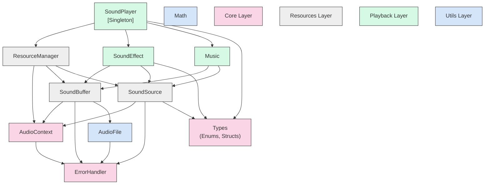

```mermaid
flowchart TD
    %% Define styles
    classDef core fill:#f9d5e5,stroke:#333,stroke-width:1px
    classDef resources fill:#eeeeee,stroke:#333,stroke-width:1px
    classDef playback fill:#d5f9e5,stroke:#333,stroke-width:1px
    classDef utils fill:#d5e5f9,stroke:#333,stroke-width:1px
    
    %% Core Layer Nodes
    AudioContext["AudioContext"]:::core
    ErrorHandler["ErrorHandler"]:::core
    Types["Types\n(Enums, Structs)"]:::core
    
    %% Resource Layer Nodes
    SoundBuffer["SoundBuffer"]:::resources
    SoundSource["SoundSource"]:::resources
    ResourceManager["ResourceManager"]:::resources
    
    %% Playback Layer Nodes
    SoundEffect["SoundEffect"]:::playback
    Music["Music"]:::playback
    SoundPlayer["SoundPlayer\n[Singleton]"]:::playback
    
    %% Utils Layer Nodes
    AudioFile["AudioFile"]:::utils
    Math["Math"]:::utils
    
    %% Core Layer Relationships
    AudioContext --> ErrorHandler
    
    %% Resource Layer Relationships
    SoundBuffer --> AudioContext
    SoundBuffer --> ErrorHandler
    SoundBuffer --> AudioFile
    SoundSource --> AudioContext
    SoundSource --> ErrorHandler
    SoundSource --> Types
    ResourceManager --> AudioContext
    ResourceManager --> SoundBuffer
    ResourceManager --> SoundSource
    
    %% Playback Layer Relationships
    SoundEffect --> SoundBuffer
    SoundEffect --> SoundSource
    SoundEffect --> Types
    Music --> SoundBuffer
    Music --> SoundSource
    SoundPlayer --> ResourceManager
    SoundPlayer --> SoundEffect
    SoundPlayer --> Music
    SoundPlayer --> Types
    
    %% Utils Layer Relationships
    AudioFile --> ErrorHandler
    
    %% Layer Labels
    CoreLabel["Core Layer"]:::core
    ResourcesLabel["Resources Layer"]:::resources
    PlaybackLabel["Playback Layer"]:::playback
    UtilsLabel["Utils Layer"]:::utils
    
    %% Subgraphs for clearer organization (uncomment if needed)
    %% subgraph Core
    %%     AudioContext
    %%     ErrorHandler
    %%     Types
    %% end
    
    %% subgraph Resources
    %%     SoundBuffer
    %%     SoundSource
    %%     ResourceManager
    %% end
    
    %% subgraph Playback
    %%     SoundEffect
    %%     Music
    %%     SoundPlayer
    %% end
    
    %% subgraph Utils
    %%     AudioFile
    %%     Math
    %% end
```